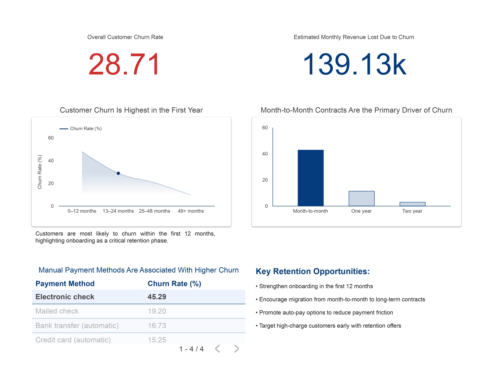

# 📊 Customer Churn Analytics & Retention Strategy Dashboard

## 📊 Dashboard Preview

🔗 **Dashboard Link:**  
https://lookerstudio.google.com/reporting/4104056e-dc81-41a3-b43f-9043bce2784b

---

## 📌 Project Overview
Customer churn is a critical challenge for subscription-based businesses, as losing customers directly impacts revenue and long-term growth.  
This project analyzes customer behavior data from a telecom company to identify **when**, **why**, and **how** customers churn, and translates those insights into **actionable retention strategies**.

The focus of this project is on **business analytics and decision-making**, not heavy machine learning, making it highly relevant for **Data Analyst** and **Business Analyst** roles.

---

## 🎯 Business Objectives
- Measure overall customer churn and its revenue impact  
- Identify key churn drivers across the customer lifecycle  
- Analyze behavioral factors influencing churn  
- Provide data-backed retention recommendations  

---

## 🛠️ Tech Stack
- **Python**: pandas, matplotlib, seaborn (EDA & insight validation)
- **SQL (MySQL)**: data cleaning, aggregation, KPI computation
- **Looker Studio**: interactive dashboard and storytelling
- **GitHub**: version control and project documentation

---

## 🧹 Data Preparation & Cleaning
- Imported raw telecom churn dataset into MySQL  
- Handled missing and inconsistent values (e.g., `TotalCharges`)  
- Converted fields to appropriate data types  
- Created analytics-ready tables and views  
- Ensured consistency between SQL and Python outputs  

---

## 📈 Key Analyses Performed

### 1. Overall Churn & Revenue Impact
- Calculated overall customer churn rate  
- Estimated monthly revenue lost due to churn  

### 2. Customer Lifecycle Analysis
- Analyzed churn by tenure buckets  
- Identified high churn risk during the first 12 months  

### 3. Contract Type Impact
- Compared churn rates across contract durations  
- Found month-to-month contracts as the primary churn driver  

### 4. Payment Behavior Analysis
- Evaluated churn by payment method  
- Observed higher churn among manual payment users  

### 5. Python Exploratory Data Analysis
- Visualized tenure, pricing, and contract patterns  
- Validated SQL insights using independent analysis  
- Focused on explainability and business relevance  

---

## 📊 Interactive Dashboard
The final insights are presented through a clean, executive-friendly **Looker Studio dashboard** featuring:
- Executive summary KPIs  
- Churn trends by tenure  
- Contract and payment behavior analysis  
- Revenue impact visualization  
- Actionable retention insights

---

## 💡 Key Business Insights
- Customer churn is highest within the first year of service  
- Month-to-month contracts significantly increase churn risk  
- Manual payment methods are associated with higher churn  
- Early-stage, high-charge customers require targeted retention efforts  

---

## 📌 Retention Recommendations
- Strengthen onboarding during the first 12 months  
- Encourage migration from month-to-month to long-term contracts  
- Promote auto-pay options to reduce payment friction  
- Target high-charge customers early with retention offers  

---

## 🚀 Why This Project Matters
This project demonstrates the ability to:
- Think from a **business perspective**
- Use **SQL for analytics**, not just querying
- Apply Python for **insight discovery and validation**
- Build **clean, non-cluttered dashboards**
- Communicate findings clearly to non-technical stakeholders  

---

## 📎 Future Enhancements
- Add churn prediction using interpretable models  
- Incorporate customer support and usage data  
- Track retention strategy effectiveness over time  

---

## 👤 Author
**Rashamvir**  
Aspiring Data Analyst | Business Analytics | SQL | Python | BI Dashboards  
